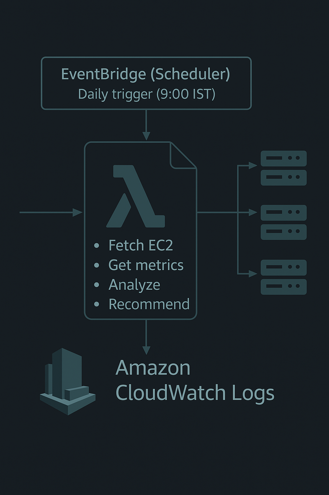

# ☁️ Cloud Cost Optimizer (AWS Lambda + CloudWatch + EventBridge)

## 🚀 Overview  
**Cloud Cost Optimizer (SCRO)** is a **serverless AWS solution** built with **Lambda**, **Boto3**, **CloudWatch**, and **EventBridge** that analyzes EC2 instance utilization and recommends optimization actions.  

It automatically retrieves **CPU** and **network metrics**, classifies instances as *Idle*, *Underutilized*, or *Normal*, and provides cost-saving suggestions — running daily using **EventBridge Scheduler**.  

This project demonstrates **real-world AWS automation** and **FinOps concepts** — perfect for a **fresher-level DevOps/Cloud resume**.

---

## 🧩 Architecture  



### Flow:
1. **EventBridge (Scheduler)** triggers the Lambda every morning at **9:00 AM IST**.  
2. **Lambda (Python + Boto3)**:
   - Fetches all EC2 instances  
   - Retrieves CPU & network metrics from CloudWatch  
   - Analyzes utilization  
   - Classifies instances: Idle / Underutilized / Normal  
   - Logs summary results to CloudWatch  
3. **CloudWatch Logs** stores detailed outputs for review.

---

## ⚙️ Tech Stack  

| Component | Purpose |
|------------|----------|
| **AWS Lambda (Python 3.11)** | Executes analysis logic |
| **Boto3 SDK** | Communicates with EC2 & CloudWatch |
| **EventBridge** | Schedules automatic daily runs |
| **CloudWatch Logs** | Stores and monitors Lambda output |
| **IAM Role** | Provides least-privilege permissions |
| **GitHub** | Version control & showcase |

---

## 🧠 Key Features  

✅ Fetches EC2 instance details (name, state, tags)  
✅ Pulls CloudWatch metrics (CPUUtilization, NetworkIn, NetworkOut)  
✅ Classifies instances as:
- 💤 **Idle** — CPU < 5%, low network  
- ⚙️ **Underutilized** — CPU < 20%  
- 🚀 **Normal** — active usage  
✅ Optional cost estimation via `scro:hourly_usd` tag  
✅ Dry-run mode (safe testing — doesn’t stop EC2s)  
✅ Automated daily scan using EventBridge Scheduler  

---

## 🛠 Setup Steps  

### 1️⃣ Create IAM Role  
- **Role name:** `scro-lambda-role`  
- Attach policies:  
  - `AmazonEC2ReadOnlyAccess`  
  - `CloudWatchFullAccess`  
  - `AWSLambda_FullAccess`  
  - `IAMReadOnlyAccess`

---

### 2️⃣ Create Lambda Function  
- **Function name:** `scro-daily-scan`  
- **Runtime:** Python 3.11  
- **Handler:** `app.handler`  
- **Role:** `scro-lambda-role`  
- **Timeout:** 1 minute  

Upload your `lambda_package.zip` under **Code → Upload from → .zip file**.

---

### 3️⃣ Set Environment Variables  

| Key | Value | Description |
|------|--------|-------------|
| `LOOKBACK_DAYS` | `7` | Analyze last 7 days of metrics |
| `OPTIN_TAG_KEY` | `scro:optin` | Tag key for selecting EC2s |
| `OPTIN_TAG_VAL` | `true` | Tag value |
| `DRY_RUN` | `true` | Prevents actual stopping of EC2 |
| `COST_TAG_KEY` | `scro:hourly_usd` | Optional — hourly cost tag |

**Screenshot Example:**


---

### 4️⃣ Run a Manual Test  

- Go to **Test** tab → create test event `{}` → click **Test**  

✅ Expected Output:
```json
{
  "timestamp": "2025-10-15T19:20:12Z",
  "region": "us-west-2",
  "instance_count": 2,
  "results": [
    {
      "id": "i-0abc123456789",
      "name": "web-server",
      "cpu_avg_pct": 3.12,
      "net_in_avg": 20000.0,
      "net_out_avg": 15000.0,
      "status": "idle",
      "recommendation": "stop",
      "optin": true,
      "est_monthly_savings_usd": 16.56
    }
  ],
  "summary_line": "Summary: 1 instance → 1 idle | 0 underutilized | 0 normal | 0 actions executed (DRY-RUN)"
}
```
<h2>6️⃣ Monitor Logs</h2>

<p>
<b>CloudWatch → Log groups → /aws/lambda/scro-daily-scan</b><br>
View detailed analysis and summary lines.
</p>

<p><b>Example:</b></p>


<hr>

<h2>🧹 Cleanup After Testing</h2>

<p><b>To avoid charges:</b></p>
<ul>
  <li>Delete <b>EventBridge rule</b> → <code>scro-daily-scan</code></li>
  <li>Delete <b>Lambda function</b></li>
  <li>Delete <b>IAM role</b> → <code>scro-lambda-role</code></li>
  <li>Delete <b>CloudWatch Log group</b> → <code>/aws/lambda/scro-daily-scan</code></li>
  <li>(Optional) Remove <b>tags</b> from EC2 instances</li>
  <li>Verify EventBridge <b>schedules</b> and <b>rules</b> are empty</li>
</ul>

<hr>

<h2>📈 Future Enhancements</h2>

<ul>
  <li>Add cost analysis for <b>S3 / RDS / EBS</b></li>
  <li>Send summary via <b>SNS</b> or email</li>
  <li>Build a <b>CloudWatch Dashboard</b></li>
  <li>Integrate with <b>Slack notifications</b></li>
</ul>

<hr>

<h2>👨‍💻 Author</h2>

<p>
<b>Mohammad Sharuf</b><br>
Cloud &amp; DevOps Enthusiast | AWS | Python | Automation
</p>

<p>
📂 <b>GitHub Repo:</b> <a href="https://github.com/mdsharuf/cloud-cost-optimizer" target="_blank">cloud-cost-optimizer</a>
</p>

<hr>

<h2>💬 Interview Summary (use this answer)</h2>

<p>
“This project is a <b>serverless Cloud Cost Optimizer</b> built using AWS Lambda, CloudWatch, and EventBridge.<br>
It analyzes EC2 instance utilization automatically every day and identifies <b>idle</b> or <b>underutilized</b> instances.<br>
I set up IAM roles, environment variables, and automation using EventBridge — keeping it safe with a <b>dry-run mode</b>.<br>
It’s a real-world <b>FinOps concept</b> implemented using <b>free-tier AWS services</b>.”
</p>

